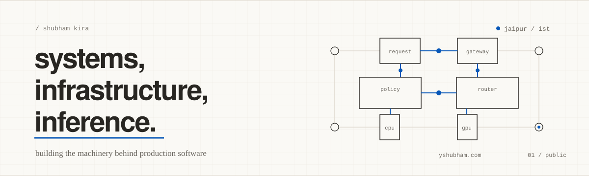

<picture>
  <source media="(prefers-color-scheme: dark)" srcset="./assets/profile-dark.svg">
  <source media="(prefers-color-scheme: light)" srcset="./assets/profile-light.svg">
  
</picture>

  <a href="https://yshubham.com">website</a> ·
  <a href="https://yshubham.com/work/">work</a> ·
  <a href="https://yshubham.com/blog/">writing</a> ·
  <a href="https://yshubham.com/tools/">tools</a> ·
  <a href="https://git.yshubham.com/">git</a> ·
  <a href="mailto:hi@ykira.com">email</a>

 

# hey, i'm shubham

i also go by **kira**. i'm a systems engineer from jaipur, india.

 

## 01 / work

- software engineer at [commandcode.ai](https://commandcode.ai), working on inference infrastructure, deployments, observability, gpu systems, and devops
- previously co-founder & cto at [routing.run](https://routing.run), where i built an llm api gateway with multi-provider routing, fallbacks, authentication, billing, and provider health monitoring; the company was later acquired
- previously senior software engineer at [MegaLLM](https://megallm.io), working across ai routing, backend platforms, macos, fine-tuning pipelines, and ci/cd
- previously backend & devops engineer at [DynTech](https://enigma.ws) and backend developer at [Groot Music](https://grootbot.pro)

more details at [yshubham.com/work](https://yshubham.com/work/).

## 02 / things i've built

- [**routing.run**](https://routing.run) — a multi-provider llm api gateway with routing, fallback, authentication, billing, and provider health
- [**UltraBalancer**](https://ultrabalancer.com) — a production-grade http/2 load balancer written in rust
- [**Sandbox**](https://github.com/bas3line/sandbox) — a self-hosted rust platform for running untrusted code in isolated, disposable environments
- [**Watchman**](https://github.com/bas3line/watchman) — a rust toolkit for monitoring, benchmarking, and debugging production gpu inference servers
- [**Honeypot**](https://github.com/bas3line/honeypot) — an ssh honeypot for cybersecurity training

my public repositories are also mirrored on my self-hosted forge at [git.yshubham.com](https://git.yshubham.com/).

rust · go · python · typescript · zig · swift · linux · postgresql · redis · docker · kubernetes · aws · grafana · prometheus

## 03 / outside code

i love reading and collecting manga, manhwa, comics, and novels. i'm currently reading **Bakuman**, **Kagurabachi**, and **Bleach**. the shelf also includes complete runs of **Naruto**, **Death Note**, **Solo Leveling**, **The Boys**, and **Invincible**.

see the collection and what i'm reading next at [yshubham.com/manga](https://yshubham.com/manga/).

## 04 / elsewhere

[website](https://yshubham.com) · [work](https://yshubham.com/work/) · [writing](https://yshubham.com/blog/) · [tools](https://yshubham.com/tools/) · [git](https://git.yshubham.com/) · [shelf](https://yshubham.com/manga/) · [x](https://x.com/inlovewithgo) · [linkedin](https://www.linkedin.com/in/extractings/) · [email](mailto:hi@ykira.com)
