<h3><code>bas3line@github ~ $ ./contributions.sh</code></h3>

 
 

<h3><code>bas3line@github ~ $ whoami</code></h3>

<table>
<tr>
<td valign="top"></td>
<td valign="top"></td>
</tr>
</table>

 

<h3><code>bas3line@github ~ $ ./connect.sh</code></h3>

<b>Systems developer by day &middot; infra builder by night</b>

