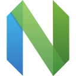

  

<h1 align="center">hey, i'm shubham</h1>

  systems &amp; backend engineer from jaipur, india — i also go by <b>kira</b>. 
  i build inference infrastructure, low-level tools, and production paths that stay understandable under load.

  <a href="https://github.com/bas3line" title="github"><picture><source media="(prefers-color-scheme: dark)" srcset="assets/icons/github-dark.svg"></picture></a>
  &nbsp;&nbsp;
  <a href="https://x.com/inlovewithgo" title="x"><picture><source media="(prefers-color-scheme: dark)" srcset="assets/icons/x-dark.svg"></picture></a>
  &nbsp;&nbsp;
  <a href="https://www.linkedin.com/in/extractings/" title="linkedin"><picture><source media="(prefers-color-scheme: dark)" srcset="assets/icons/linkedin-dark.svg"></picture></a>
  &nbsp;&nbsp;
  <a href="mailto:hi@yshubham.com" title="hi@yshubham.com"><picture><source media="(prefers-color-scheme: dark)" srcset="assets/icons/mail-dark.svg"></picture></a>
  &nbsp;&nbsp;
  <a href="https://cal.com/shubhamyadav" title="book a call"><picture><source media="(prefers-color-scheme: dark)" srcset="assets/icons/calendar-dark.svg"></picture></a>

  <a href="https://yshubham.com"> website</a> ·
  <a href="https://yshubham.com/work/"> work</a> ·
  <a href="https://yshubham.com/blog/"> writing</a> ·
  <a href="https://yshubham.com/tools/"> tools</a> ·
  <a href="https://git.yshubham.com/"> git</a> ·
  <a href="https://yshubham.com/manga/"> shelf</a> ·
  <a href="https://yshubham.com/shubham.json"> shubham.json</a>

---

## work

**software engineer** at **[commandcode.ai](https://commandcode.ai)** · jun 2026 — present

inference infrastructure and devops for production ai systems — high-throughput apis, gpu fleet reliability, deployments, observability, and safe release paths.

previously:

| | role | what i did |
|---|---|---|
| **[routing.run](https://routing.run)** | co-founder & cto | built an llm api gateway from scratch — multi-provider routing, fallback, auth, billing, provider health. ran it through acquisition and handover. |
| **[MegaLLM](https://megallm.io)** | founding member & senior software engineer | a swift macos app with system-level integrations, a multi-tenant reseller platform, go and typescript routing backends, lora training workflows, jenkins release pipelines. |
| **[DynTech](https://enigma.ws)** | software engineer | auth and subscription systems for a copy-trading platform, plus the jenkins/docker deployment path. |
| **[Groot Music](https://grootbot.pro)** | software engineer | scaled the backend of a high-traffic discord music bot across thousands of servers. |
| **MemePay** | cto | a solana trading product across frontend, backend, and deployment. |
| **Meds Reminder** | backend developer | apis and data handling for medication reminders and scheduling. |

the full timeline lives at **[yshubham.com/work](https://yshubham.com/work/)**.

## projects

| | stack | what it is |
|---|---|---|
| **[routing.run](https://routing.run)** | python · fastapi · postgresql · redis | a stable openai-compatible endpoint over a model market that changes every week — [case study](https://yshubham.com/work/routing-run/) |
| **[Sandbox](https://github.com/bas3line/sandbox)** | rust · postgresql · nats · docker | disposable coding environments for humans and agents, with policy enforced by the server instead of the prompt — [docs](https://docs.yshubham.com/v2/products/sandbox) |
| **[Watchman](https://github.com/bas3line/watchman)** | rust | an operator's lens for gpu inference servers: inspect, benchmark, and catch trouble before users do — [docs](https://docs.yshubham.com/v2/products/watchman) |
| **[UltraBalancer](https://github.com/bas3line/ultrabalancer)** | rust · tokio · http/2 | a small, inspectable http/2 data path built to stay fast when connection counts stop being friendly — [case study](https://yshubham.com/work/ultrabalancer/) |
| **[Context Bridge](https://github.com/bas3line/Context-Bridge)** | rust | moves coding-session context between opencode, claude code, and codex without pretending hidden model state is portable — [docs](https://docs.yshubham.com/v2/context-bridge/overview) |
| **[Honeypot](https://github.com/bas3line/honeypot)** | rust | an ssh honeypot for cybersecurity training and attack-surface observation |

## things i run

self-hosted, and public if you want to poke at them:

- **[git.yshubham.com](https://git.yshubham.com/)** — forgejo mirror of my repos, resynced every two minutes
- **[docs.yshubham.com](https://docs.yshubham.com)** — tool docs, agent skills, and mcp setup
- **[status.yshubham.com](https://status.yshubham.com)** — live health checks and incident notes
- **[trace.yshubham.com](https://trace.yshubham.com)** — browser-side https endpoint probe and request-path map
- **[objects.yshubham.com](https://objects.yshubham.com/)** — screened, expiring public object storage on r2 + queues
- **[saucer.sh](https://saucer.sh)** — invite-only file sharing: put a file on the web from your terminal or your browser, at a link you control

## skills

  &nbsp;
  <picture><source media="(prefers-color-scheme: dark)" srcset="assets/tech/rust-dark.svg"></picture>&nbsp;
  &nbsp;
  &nbsp;
  &nbsp;
  &nbsp;
  &nbsp;
  &nbsp;
  &nbsp;
  <picture><source media="(prefers-color-scheme: dark)" srcset="assets/tech/bun-dark.svg"></picture>&nbsp;
  &nbsp;
  &nbsp;
  &nbsp;
  &nbsp;
  &nbsp;
  &nbsp;
  &nbsp;
  &nbsp;
  <picture><source media="(prefers-color-scheme: dark)" srcset="assets/tech/sqlite-dark.svg"></picture>&nbsp;
  &nbsp;
  &nbsp;
  &nbsp;
  <picture><source media="(prefers-color-scheme: dark)" srcset="assets/tech/kafka-dark.svg"></picture>&nbsp;
  &nbsp;
  &nbsp;
  &nbsp;
  <picture><source media="(prefers-color-scheme: dark)" srcset="assets/tech/helm-dark.svg"></picture>&nbsp;
  &nbsp;
  &nbsp;
  &nbsp;
  &nbsp;
  &nbsp;
  &nbsp;
  &nbsp;
  &nbsp;
  &nbsp;
  &nbsp;
  &nbsp;
  &nbsp;
  &nbsp;
  <picture><source media="(prefers-color-scheme: dark)" srcset="assets/tech/opentelemetry-dark.svg"></picture>&nbsp;
  <picture><source media="(prefers-color-scheme: dark)" srcset="assets/tech/sentry-dark.svg"></picture>&nbsp;
  &nbsp;
  &nbsp;
  <picture><source media="(prefers-color-scheme: dark)" srcset="assets/tech/linux-dark.svg"></picture>&nbsp;
  &nbsp;
  

  icons from <a href="https://yshubham.com">yshubham.com</a> · <a href="mailto:hi@yshubham.com">hi@yshubham.com</a>

